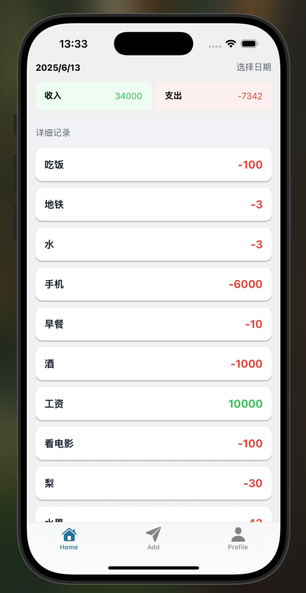
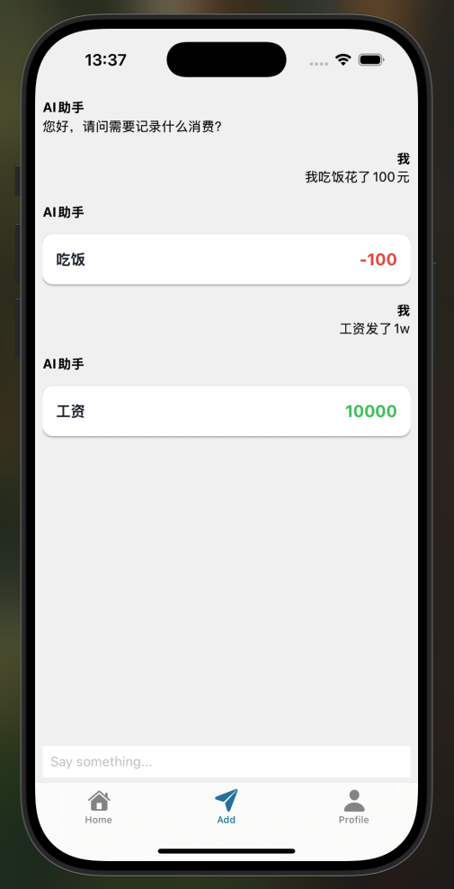
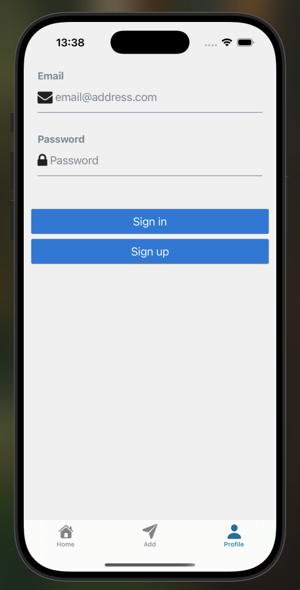

# 项目描述

一个 ai 记账软件，参考教程：https://www.bilibili.com/video/BV1qiLuzCERB/

# 功能

1. 注册登录；
2. 对话功能：

- 普通对话；
- 使用 ai 将自然语言转化为账单结构体；

3. 首页按日期查询功能；

# 技术栈

移动端：

- 框架：ReactNative（expo）
- 状态管理：Zustand
- 对话功能实现：AI SDK

服务端：

- 框架：Node.js 的 Express + typescript
- 登录注册：Supabase auth + JWT
- 数据库：Supabase 提供的 Postgresql
- ORM：Drizzle
- AI 模型：Deepseek

# 截图

